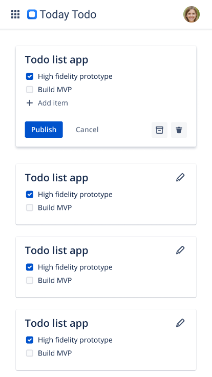

# Today Todo
_Simple todo list application, used to practice full-stack development._

## Design Prototype
### Mobile  
  

### Desktop

## Application Architecture

## Data Model

## Design Consideration
**Load Balancer**  
- Purpose: SSL connection, route front-end version requests  
- Additions needed to scale: balance traffic between EC2 instances (autoscaling group)  

**S3 Storage**  
- Purpose: Serve static font-end  
- Additions needed to scale: position CDN (CloudFront) ahead of self  

**DynamoDB Database**
- Purpose: OLTP database. Data model cross compatable with all application versions.  
- Additions needed to scale: memcached (if using complex queries), user isolation & encryption  

**EC2 API Service**  
- Purpose: REST API for application transactions  
- Additions needed to scale: rate limiting
